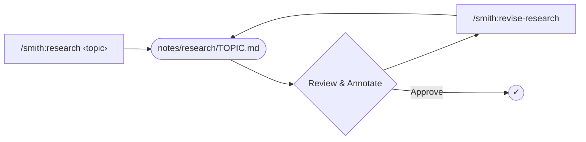
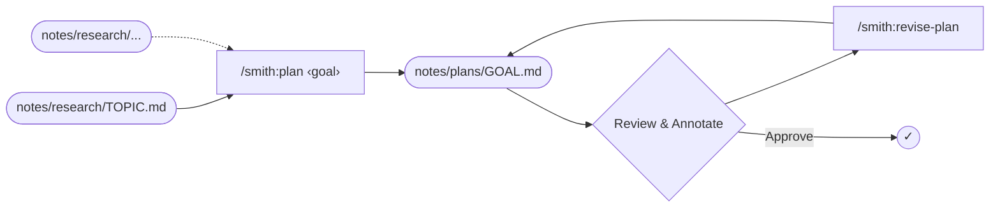
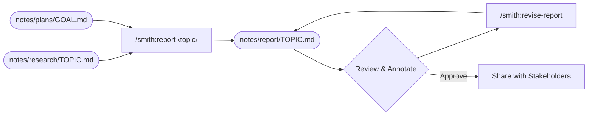
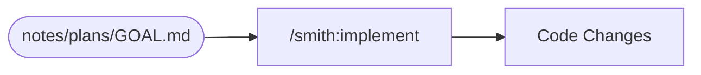

# Smith

A structured agent pipeline for Claude Code. Research a codebase, plan changes, and implement them through a human-in-the-loop workflow.

All artifacts are persisted as Markdown in a `notes/` directory within your project.

## Install

```
/plugin install smith
```

## The Workflow

### Research and Discovery

Explore a topic in the codebase. The agent reads files, traces data flows, and produces a structured findings document. Annotate the document inline with corrections or questions, then revise. Repeat until the research is crisp.



| Command | Description |
|---------|-------------|
| `/smith:research ‹topic›` | Research a topic in the codebase |
| `/smith:revise-research` | Revise research based on inline annotations |

### Planning

Design an implementation approach from one or more research documents. The agent produces an ordered task checklist with specific file paths and test-first structure. Annotate the plan inline to adjust scope, ordering, or approach, then revise. Repeat until the plan is ready to execute.



| Command | Description |
|---------|-------------|
| `/smith:plan ‹goal›` | Create an implementation plan from research |
| `/smith:revise-plan` | Revise plan based on inline annotations |

### Socializing

Synthesize research and plans into an RFD-style document for stakeholder review. Annotate the report inline to refine framing, clarify trade-offs, or fill gaps, then revise. Repeat until it is ready to share.



| Command | Description |
|---------|-------------|
| `/smith:report ‹topic›` | Synthesize research and plans into an RFD-style report |
| `/smith:revise-report` | Revise report based on inline annotations |

### Execution

Execute an approved plan. The agent works through the task checklist, following a red-green-refactor cycle and validating continuously.



| Command | Description |
|---------|-------------|
| `/smith:implement` | Execute the approved plan |

## Other Commands

| Command | Description |
|---------|-------------|
| `/smith:webview [file]` | Render a notes document in the browser |


## Resources

Articles who's methodologies inspired aspects of this work.

- [Red-Green TDD](https://simonwillison.net/guides/agentic-engineering-patterns/red-green-tdd/) (Willison, 2026)
- [How I Use Claude Code](https://boristane.com/blog/how-i-use-claude-code/) (Boris Tane, 2026)
- [Engineering Rigor in the LLM Age](https://oxide-and-friends.transistor.fm/episodes/engineering-rigor-in-the-llm-age) (Oxide and Friends, 2026)
- [Here’s how I use LLMs to help me write code](https://simonwillison.net/2025/Mar/11/using-llms-for-code/) (Willison, 2025)
- [Effective Context Engineering for AI Agents](https://www.anthropic.com/engineering/effective-context-engineering-for-ai-agents) (Anthropic, 2025)
- [Agentic Engineering Patterns](https://simonwillison.net/guides/agentic-engineering-patterns/) (Willison)
- [Claude Code Best Practices](https://www.anthropic.com/engineering/claude-code-best-practices) (Anthropic)
- [Prompting Best Practices](https://platform.claude.com/docs/en/build-with-claude/prompt-engineering/claude-prompting-best-practices) (Anthropic)
