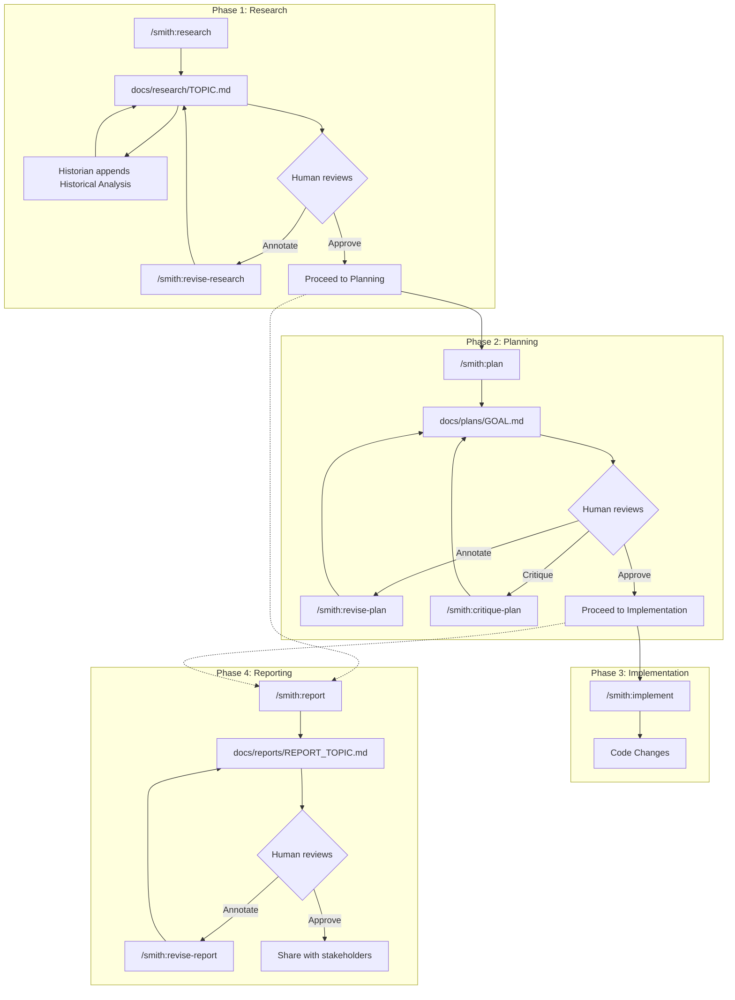

# Research: Agent Usage in Smith

## Overview

Smith is a Claude Code plugin that implements a structured, human-in-the-loop agent pipeline for software development. The pipeline decomposes work into discrete phases (Research, Plan, Critique, Implement, Report) with Markdown documents as the shared artifacts between phases. Each phase is handled by a specialized agent with its own system prompt, model assignment, and permission mode. Agents are dispatched via slash commands that serve as orchestration scripts, using Claude Code's Task tool with the `subagent_type` parameter to invoke the correct agent definition. The human reviewer participates at every phase boundary through an annotation cycle: adding inline notes to the Markdown artifacts, then re-dispatching the agent to address them.

Key takeaways:

- Six agent types exist: Researcher, Planner, Critic, Implementer, Reporter, Historian.
- Agents are defined as Markdown files with YAML frontmatter in the `agents/` directory.
- Commands in the `commands/` directory serve as dispatch scripts that orchestrate agent invocations.
- The `subagent_type` parameter on the Task tool maps directly to the agent's `name` field in the frontmatter.
- All agents run in the foreground (`background: false`) and most use `permissionMode: acceptEdits`.
- Documents in `docs/research/`, `docs/plans/`, and `docs/reports/` are the shared mutable state. They are the communication medium between agents, phases, and the human reviewer.
- The annotation cycle (write, annotate, revise) is the primary feedback mechanism and is supported by Researcher, Planner, Critic, and Reporter agents.

## Architecture

### Directory Layout

```
smith/
  .claude-plugin/
    plugin.json          # Plugin metadata (name, description, author)
  agents/                # Agent definitions (Markdown + YAML frontmatter)
    researcher.md
    planner.md
    implementer.md
    critic.md
    reporter.md
    historian.md
  commands/              # Slash command dispatch scripts
    research.md
    revise-research.md
    plan.md
    revise-plan.md
    critique-plan.md
    implement.md
    report.md
    revise-report.md
    webview.md
  bin/
    mdview               # Python script for rendering Markdown in browser/PDF
  lib/
    mdview/              # JS/CSS assets for the mdview renderer
  README.md
```

### Pipeline Flow

The system implements a four-stage pipeline with revision loops at three of the four stages:



### Two-Layer Architecture

Smith uses a two-layer architecture to separate concerns:

1. **Commands** (in `commands/`): Slash-command entry points exposed to the user. Each command is a Markdown file with YAML frontmatter (containing `description`) and a body that describes the orchestration steps. Commands do not contain agent behavior; they describe how to dispatch agents and what to do with their results.

2. **Agents** (in `agents/`): Reusable agent definitions with full system prompts. Each agent file has YAML frontmatter (containing `name`, `description`, `model`, `permissionMode`, `background`) and a body that serves as the agent's system prompt when it is dispatched via the Task tool.

The commands layer acts as the "controller" and the agents layer as the "workers." The user interacts only with commands; commands dispatch agents via `subagent_type`.

## Key Components

### Agent Definitions

All agent definitions live in `/Users/brett/Code/claude-plugins/smith/agents/` and share a common structure:

**YAML Frontmatter Fields:**

| Field | Purpose | Values observed |
|-------|---------|-----------------|
| `name` | Agent identifier, referenced by `subagent_type` in commands | `Researcher`, `Planner`, `Implementer`, `Critic`, `Reporter`, `Historian` |
| `description` | Human-readable summary of the agent's purpose | Varies per agent |
| `model` | Which Claude model to use | `inherit` (Researcher, Planner), `sonnet` (Implementer, Critic, Reporter), `haiku` (Historian) |
| `permissionMode` | File editing permissions | `acceptEdits` (all except Implementer) |
| `background` | Whether to run in the background | `false` (all agents) |

The `model` field has three observed values:
- **`inherit`**: Uses the same model as the parent conversation. Assigned to Researcher and Planner, the agents that do the heaviest analytical work.
- **`sonnet`**: Uses Claude Sonnet. Assigned to Implementer, Critic, and Reporter.
- **`haiku`**: Uses Claude Haiku. Assigned to Historian, which does lightweight git log analysis.

The `permissionMode: acceptEdits` setting is present on all agents except the Implementer. The Implementer lacks this field entirely, which means it operates under the default permission mode. This is intentional: the Implementer needs interactive Bash permission prompts for running tests and executing code, as noted in `commands/implement.md` (line 19): "The Implementer needs interactive Bash permission prompts, which only work in the foreground."

#### **`agents/researcher.md`**

- **Purpose**: Deep-read analysis of code, documentation, and system architecture. Produces structured research reports.
- **Output**: `docs/research/TOPIC.md` with sections: Overview, Architecture, Key Components, Patterns and Conventions, Dependencies and Coupling, Risks and Considerations.
- **Key behaviors**:
  - Derives a kebab-case topic slug from the task description (line 21).
  - Creates `docs/research/` directory if needed.
  - On re-dispatch, reads existing file and addresses inline annotations without starting over (line 22).
  - Must preserve the `## Historical Analysis` section written by the Historian (line 85).
  - If scope changes significantly during revision, adds a `> **Stale History:**` marker above the Historical Analysis section (line 85).
- **Rules of note**: No code writing, no planning, no em-dashes, format file references in backticks, use Mermaid judiciously.

#### **`agents/planner.md`**

- **Purpose**: Takes research findings and a task description, produces a detailed implementation plan.
- **Input**: Reads from `docs/research/*.md` (globs and selects; asks user if ambiguous).
- **Output**: `docs/plans/GOAL.md` with sections: Goal, Approach, Trade-offs, Changes (with File/What/Why/Snippet per change), Tasks (granular checklist), Validation.
- **Key behaviors**:
  - Derives kebab-case GOAL slug from the goal description (line 20).
  - Plans include a "Based on research in..." header linking back to the source research file (line 32).
  - Tasks are structured for red-green TDD: test task before implementation task (lines 96-104).
  - Does not implement on approval (line 113).

#### **`agents/implementer.md`**

- **Purpose**: Executes an approved plan by writing code.
- **Input**: Reads from `docs/plans/*.md` and referenced `docs/research/*.md`.
- **Output**: Code changes, plus marking task items complete in the plan file (`- [ ]` to `- [x]`).
- **Key behaviors**:
  - Follows strict red-green-refactor cycle (lines 20-23).
  - Validates continuously at every phase of the cycle.
  - Marks progress in the plan file as each task completes (line 25).
  - Does not redesign or freelance improvements (line 38).
  - Surfaces blockers rather than guessing (line 44).
  - Only agent without `permissionMode: acceptEdits` (needs interactive Bash prompts).

#### **`agents/critic.md`**

- **Purpose**: Critically reviews a plan, adding inline annotations to surface weaknesses.
- **Input**: Reads plan from `docs/plans/*.md` and referenced research from `docs/research/*.md`.
- **Output**: The same plan file, with inline annotations inserted at points of concern.
- **Key behaviors**:
  - Uses seven labeled annotation categories (lines 35-39): `Gap`, `Risk`, `Unclear`, `Assumption`, `Ordering`, `Conflict`, `Scope`.
  - Annotations are blockquote-formatted: `> **Category:** description`.
  - Does not rewrite the plan; only inserts annotations (line 91).
  - Evaluates against seven dimensions (lines 53-87): Completeness, Correctness, Feasibility, Test Coverage, Clarity, Consistency, Scope.
  - If the plan is solid, says so with a brief note at the top (line 96).

#### **`agents/reporter.md`**

- **Purpose**: Synthesizes research and plan documents into an RFD-style (Request for Discussion) document.
- **Input**: Reads from `docs/research/*.md` and `docs/plans/*.md`.
- **Output**: `docs/reports/REPORT_TOPIC.md` with RFD frontmatter (title, state, authors, date, labels) and sections: Background, Problem Statement, Options Considered, Proposed Solution, Impact Analysis, Open Questions, References.
- **Key behaviors**:
  - Writes for an audience unfamiliar with Smith tooling internals (line 133).
  - Does not reproduce the plan's task checklist (line 131).
  - Does not invent technical decisions; flags missing information in Open Questions (line 130).
  - Can use `AskUserQuestion` to request author name (line 137).

#### **`agents/historian.md`**

- **Purpose**: Analyzes git history for specific file paths and appends findings to an existing research document.
- **Input**: Research file path and list of key file/directory paths (extracted from the research file by the command).
- **Output**: Appends a `## Historical Analysis` section with subsections: Major Changes, Change Patterns, Contributors.
- **Key behaviors**:
  - Uses `haiku` model, the lightest weight (line 4).
  - Always dispatched as Phase 2 of the `/smith:research` command, never independently.
  - If `## Historical Analysis` already exists and has no stale marker, stops immediately (line 25).
  - If a `> **Stale History:**` marker is present, removes the old section and writes a fresh one (line 25-26).
  - Uses git commands (`git log`, `git shortlog`, `git diff`) via Bash (line 27).
  - Limits git output with `--oneline -50`, `--no-patch`, `--stat`, and `head` to control context size (lines 28-30).

### Command Definitions

All commands live in `/Users/brett/Code/claude-plugins/smith/commands/` and serve as orchestration scripts.

**Common YAML frontmatter**: Each command has only a `description` field in its frontmatter.

#### **`commands/research.md`**: Two-phase orchestration

- Phase 1: Dispatches `Researcher` agent with user's topic description.
- Phase 2: Reads the research file, extracts key paths from Key Components and Architecture sections, dispatches `Historian` agent with the research file path and key paths.
- Wrap-up: Reports the file path and suggests next steps.

This is the only command that dispatches two different agents in sequence.

#### **`commands/revise-research.md`**: Conditional two-phase orchestration

- Phase 1: Globs for `docs/research/*.md`, dispatches `Researcher` with annotation-revision instructions.
- Phase 2 (conditional): Checks for `> **Stale History:**` marker. If present, extracts updated key paths and dispatches `Historian` to regenerate the Historical Analysis section.
- Wrap-up: Reports revision status.

#### **`commands/plan.md`**: Single-phase dispatch

- Globs for `docs/research/*.md`, dispatches `Planner` with the goal description and available research files.

#### **`commands/revise-plan.md`**: Single-phase dispatch

- Globs for `docs/plans/*.md`, dispatches `Planner` with annotation-revision instructions.

#### **`commands/critique-plan.md`**: Single-phase dispatch

- Globs for `docs/plans/*.md`, dispatches `Critic` to review and annotate the plan.

#### **`commands/implement.md`**: Single-phase dispatch

- Globs for `docs/plans/*.md`, dispatches `Implementer` to execute the plan.
- Explicitly notes `run_in_background: false` is required for interactive Bash prompts (line 18-19).

#### **`commands/report.md`**: Single-phase dispatch with disambiguation

- Globs for both `docs/research/*.md` and `docs/plans/*.md`.
- Dispatches `Reporter` with the selected research topic and plan file path(s).
- Uses the most recently modified plan by default if the user does not specify.

#### **`commands/revise-report.md`**: Single-phase dispatch

- Globs for `docs/reports/*.md`, dispatches `Reporter` with annotation-revision instructions.

#### **`commands/webview.md`**: No agent dispatch (utility command)

- Does not use the Task tool or dispatch any agent.
- Runs the `bin/mdview` script directly via Bash to render Markdown files in the browser.
- Supports three modes: single file view, PDF export, and an auto-refreshing local server (`--serve`).

### The `subagent_type` Dispatch Mechanism

The central dispatch mechanism in Smith is the Claude Code Task tool with the `subagent_type` parameter. The mapping is:

| `subagent_type` value | Agent file | Dispatched by commands |
|----------------------|------------|----------------------|
| `"Researcher"` | `agents/researcher.md` | `research.md`, `revise-research.md` |
| `"Planner"` | `agents/planner.md` | `plan.md`, `revise-plan.md` |
| `"Critic"` | `agents/critic.md` | `critique-plan.md` |
| `"Implementer"` | `agents/implementer.md` | `implement.md` |
| `"Reporter"` | `agents/reporter.md` | `report.md`, `revise-report.md` |
| `"Historian"` | `agents/historian.md` | `research.md`, `revise-research.md` |

The `subagent_type` value must match the `name` field in the agent's YAML frontmatter exactly (case-sensitive). The Task tool loads the agent definition automatically; commands explicitly note: "Do NOT paste the agent's own instructions into the prompt; the agent definitions are already loaded by the Task tool via `subagent_type`" (this exact sentence appears in every command file).

All dispatches use `run_in_background: false`, meaning the command waits for the agent to complete before proceeding.

### Artifact Flow Between Agents

Agents communicate exclusively through Markdown files on disk. There is no in-memory state sharing between agent invocations. The data flow is:

```
Researcher --> docs/research/TOPIC.md
                      |
                      v
Historian --appends--> docs/research/TOPIC.md (## Historical Analysis)
                      |
                      v
Planner ---reads----> docs/research/TOPIC.md
Planner --> docs/plans/GOAL.md
                      |
                      +--> "Based on research in [...]" header links back
                      |
                      v
Critic ---reads-----> docs/plans/GOAL.md + docs/research/TOPIC.md
Critic ---annotates-> docs/plans/GOAL.md (inline blockquote annotations)
                      |
                      v
Implementer -reads--> docs/plans/GOAL.md + docs/research/TOPIC.md
Implementer -marks--> docs/plans/GOAL.md (- [ ] to - [x])
                      |
                      v
Reporter --reads----> docs/research/TOPIC.md + docs/plans/GOAL.md
Reporter --> docs/reports/REPORT_TOPIC.md
```

Each agent discovers its input files by globbing the appropriate `docs/` subdirectory. When exactly one file exists, it is used automatically. When multiple exist, agents attempt to match by filename or topic, and ask the user if ambiguous. This pattern appears in all agents: Researcher (line 21), Planner (line 17), Implementer (line 16), Critic (line 21), Reporter (lines 20-22).

## Patterns and Conventions

### Annotation Cycle Pattern

The annotation cycle is the primary human feedback mechanism and is consistent across Researcher, Planner, and Reporter agents:

1. Agent writes or updates the document.
2. Human reviewer adds inline annotations (blockquotes, often with category prefixes).
3. User runs a `/smith:revise-*` command.
4. Agent re-reads the document, addresses each annotation, removes resolved ones.
5. If an annotation is ambiguous, the agent adds `> **Question:**` instead of resolving.
6. Repeat until approved.

The Critic agent is unique in that it *produces* annotations rather than *consuming* them. Its annotations use a structured format with seven categories (`Gap`, `Risk`, `Unclear`, `Assumption`, `Ordering`, `Conflict`, `Scope`) and are consumed by the Planner in the next revision cycle.

### Kebab-Case Slug Convention

All output filenames use kebab-case slugs derived from the task/topic/goal description:
- Research: `docs/research/TOPIC.md` (e.g., `docs/research/auth-flow.md`)
- Plans: `docs/plans/GOAL.md` (e.g., `docs/plans/rate-limiting.md`)
- Reports: `docs/reports/REPORT_TOPIC.md` (e.g., `docs/reports/rate-limiting-rfd.md`)

### Disambiguation Pattern

When multiple files exist in a `docs/` subdirectory, every agent follows the same disambiguation protocol:
1. If exactly one file exists, use it automatically.
2. If multiple exist, try to match by filename against the task/topic description.
3. If ambiguous, stop and ask the user.

### Prompt Construction Convention

Commands construct prompts for the Task tool following consistent rules (stated in every command file):
- Include the user's description/topic.
- Include the working directory path.
- Include any additional conversation context.
- Do NOT include the agent's own instructions (loaded automatically via `subagent_type`).

### Writing Style Rules

Every agent enforces these shared rules:
- **No em-dashes.** Use more specific punctuation instead.
- **Format file references in backticks.** Bold+backtick for list item leads; plain backtick inline.
- **Use Mermaid diagrams judiciously.** Prefer plain-text for simple structures.

### TDD Convention

The Planner structures tasks for red-green TDD (`agents/planner.md`, lines 96-104). The Implementer follows a strict red-green-refactor cycle (`agents/implementer.md`, lines 20-23):
1. Red: Write the test first, confirm it fails.
2. Green: Write minimum implementation to pass.
3. Refactor: Clean up, re-run all tests.

Tasks that have no meaningful automated test are explicitly marked "No automated test" in the plan.

### Research-to-Plan Link

Plans include a "Based on research in..." header that references the source research file(s) (Planner line 32). This back-link is consumed by:
- The Critic, which reads the referenced research to check plan-research alignment (Critic line 23).
- The Implementer, which reads the referenced research for codebase context (Implementer line 18).

## Dependencies and Coupling

### External Dependencies

- **Claude Code Plugin System**: Smith relies on Claude Code's plugin infrastructure, specifically:
  - The `agents/` directory convention for agent definitions.
  - The `commands/` directory convention for slash commands.
  - The Task tool with `subagent_type` parameter for dispatching agents.
  - The `.claude-plugin/plugin.json` manifest.
  - Model identifiers (`inherit`, `sonnet`, `haiku`) interpreted by Claude Code.
  - The `permissionMode` setting (`acceptEdits`) interpreted by Claude Code.

- **mdview Script Dependencies** (Python, for the webview command only):
  - `markdown-it-py[linkify,plugins]`
  - `mdit-py-plugins`
  - `weasyprint` (for PDF export)
  - Executed via `uv run --script` (line 1 of `bin/mdview`).

### Internal Coupling

- **Research-to-Plan dependency**: The Planner expects `docs/research/*.md` to exist and follows the Researcher's output format (specific section headings: Overview, Architecture, Key Components, etc.).
- **Plan-to-Implement dependency**: The Implementer expects `docs/plans/*.md` with specific structure (task checklist using `- [ ]` / `- [x]` markers, "Based on research in..." header).
- **Research-to-Historian dependency**: The `/smith:research` command extracts key paths from the Researcher's output to pass to the Historian. This creates an implicit coupling to the section structure (Key Components and Architecture sections).
- **Critic-to-Planner annotation contract**: The Critic's annotation format (blockquote with category prefix) must be parseable by the Planner during revision. This is a soft contract (human-readable text, not structured data).
- **Plan-to-Critic dependency**: The Critic reads the "Based on research in..." header to find and cross-reference the original research.

### Shared State

The only shared state between agents is the file system. Specifically:
- `docs/research/*.md`: Written by Researcher, appended by Historian, read by Planner/Critic/Implementer/Reporter.
- `docs/plans/*.md`: Written by Planner, annotated by Critic, read/modified by Implementer, read by Reporter.
- `docs/reports/*.md`: Written by Reporter, read only by the human reviewer.

No agent reads another agent's definition file. No agent writes to another agent's output directory (except the Historian appending to research files, and the Critic annotating plan files).

## Risks and Considerations

### Agent Identity and Scoping

Each agent has a clearly defined scope boundary (research only, plan only, implement only, etc.) enforced through explicit rules. For example, the Researcher states "Do not plan or propose changes" (line 86), the Planner states "Do not write or modify production code" (line 108), and the Implementer states "do not redesign, rearchitect, or freelance improvements" (line 38). These boundaries are enforced purely through system prompt instructions, not through tooling restrictions (all agents have access to the same underlying tools).

### File Discovery Fragility

Agents discover their input files by globbing `docs/` subdirectories. If multiple unrelated research or plan files accumulate across different tasks, the disambiguation logic (match by filename) could become unreliable. The fallback is to ask the user, which prevents silent mismatches but interrupts the workflow.

### Historian Coupling to Section Structure

The `/smith:research` command extracts key paths from the Researcher's output by reading the Key Components and Architecture sections (line 24-25 of `commands/research.md`). If the Researcher produces output with different section names or structures, the key path extraction could fail. This coupling is implicit and not validated.

### Stale History Marker as a Manual Protocol

The `> **Stale History:**` marker mechanism (used to signal that the Historian should regenerate its section) depends on the Researcher correctly inserting it when scope changes. This is a convention enforced by the Researcher's system prompt (`agents/researcher.md`, line 85), not by any automated check.

### Implementer Permission Mode

The Implementer is the only agent without `permissionMode: acceptEdits`. This means it requires interactive approval for Bash commands (test execution, code compilation). If the Task tool's foreground mode does not properly surface these prompts, the Implementer could stall. The `commands/implement.md` file explicitly calls this out: "Set `run_in_background: false`." (line 18).

### No Automated Validation Between Phases

There is no automated check that a research file exists before planning, or that a plan exists before implementation. Each command performs its own glob check and reports an error message if files are missing, but this is a manual guard, not a structural constraint. A user could, in theory, run `/smith:implement` without any plan file, and the command would catch it at runtime with a message to run `/plan` first.

### Annotation Format as a Soft Contract

The annotation format (blockquotes with category labels) is described in natural language in the agent prompts. There is no schema validation or structured parsing. The Critic's seven annotation categories (`Gap`, `Risk`, `Unclear`, `Assumption`, `Ordering`, `Conflict`, `Scope`) are a convention, and human annotations during the revision cycle do not need to follow these categories. This flexibility is intentional (the human reviewer is free to annotate however they wish), but it means the revision agents must handle arbitrary annotation formats.

## Historical Analysis

### Major Changes

Smith's development has followed a logical progression from core agent infrastructure to feature expansion and refinement.

**Initial Release (February 25, 2026)** in commit `3547623` established the foundational plugin with five agents (Researcher, Planner, Implementer, Reporter) and eight command scripts (research, revise-research, plan, revise-plan, implement, report, revise-report, webview). The `bin/mdview` Python script and associated CSS and JavaScript assets in `lib/mdview/` were created to provide local and PDF rendering of Markdown files. The plugin manifest in `.claude-plugin/plugin.json` was also introduced at this time. Initially, output files were written to `notes/research/`, `notes/plans/`, and `notes/reports/` directories.

**Documentation polish (February 25)** in commit `23acc4b` adjusted code fence lengths in `agents/planner.md` to improve GitHub rendering, a minor but deliberate improvement to presentation.

**Architecture expansion and directory restructuring (February 27)** in commit `b3d52f2` introduced the Historian agent (`agents/historian.md`), the most significant architectural change. This commit also overhauled output directory structure, migrating from the `notes/` hierarchy to `docs/research/`, `docs/plans/`, and `docs/reports/`. The `/smith:research` command was expanded from a single-phase dispatch to a two-phase orchestration that runs the Researcher first, then the Historian to append git history analysis. The `commands/revise-research.md` command was updated to conditionally re-run the Historian if a stale-history marker is detected. All agent and command files were updated to reference the new directory paths. This commit touched 15 files and represented the largest structural change in the project's history.

**Markdown renderer enhancements (February 27)** in commit `f1ac9d2` added YAML frontmatter rendering to `bin/mdview`, allowing Markdown files with YAML headers to display their metadata in the browser or PDF exports. This improved the usability of the webview command when working with agent and command definition files.

**Critique agent addition (March 4)** in commit `86b8574` introduced the Critic agent (`agents/critic.md`) and the new `commands/critique-plan.md` command script. The Critic added a mandatory review phase between planning and implementation, enabling structured plan validation before code is written. The agent's seven annotation categories (`Gap`, `Risk`, `Unclear`, `Assumption`, `Ordering`, `Conflict`, `Scope`) established a structured approach to surfacing plan weaknesses.

**Rendering refinements (March 6)** in commit `3f8a4f5` fixed ordered list rendering in the Markdown view, addressing a display issue in both the webview HTML and the marketplace description.

**Model optimization and historical analysis hardening (March 6)** in commit `bead836` reassigned model parameters for better performance and cost efficiency. The Historian's model was changed from `inherit` to `haiku`, reflecting that git history analysis is a lightweight task. The Critic's model was changed from `inherit` to `sonnet`, prioritizing thorough critical review. The Researcher and Planner retained `inherit` to leverage the parent conversation's model. Concurrently, the Historian's instructions were expanded with detailed guidance on output limiting (`git log --oneline -50`, `--no-patch`, `--stat`) to control context size. The `commands/revise-research.md` command was updated with clearer instructions for the conditional Historian re-run phase.

**Table rendering improvements (March 6)** in commits `901e2e0` and `7e3b89a` enhanced CSS styling for table presentation in the markdown viewer. Commit `901e2e0` added wide table support to handle larger tabular data, and commit `7e3b89a` refined alignment logic so tables are left-aligned unless their width overflows, improving readability for both narrow and wide tables.

### Change Patterns

**Stability with incremental feature addition**: The codebase exhibits high stability in the core agent and command infrastructure once established. After the initial release and structural reorganization (first four commits), subsequent changes were feature additions (Critic agent, table rendering) or refinements (model optimization, git output limiting) rather than breaking refactors. No commits rewrote or significantly restructured existing agents after their introduction.

**Centralized command logic**: Commands evolved to become increasingly sophisticated orchestration scripts. The `/smith:research` command grew from a simple single-phase dispatch to a two-phase pipeline with conditional logic in the revision variant (`revise-research.md`). This suggests that command scripts are where cross-agent coordination logic naturally gravitates, while agents remain focused on individual phases.

**Directory structure as a versioning boundary**: The migration from `notes/` to `docs/` in a single commit (`b3d52f2`) was comprehensive and coordinated across all agents and commands. This indicates deliberate architectural intent rather than gradual drift, and demonstrates that output paths are treated as API contracts between commands and agents.

**Renderer as a secondary concern**: The mdview renderer received steady, incremental improvements (YAML frontmatter, table styling) but did not undergo major refactors. These changes suggest that the renderer is a tooling enhancement that improves the user experience of reading documents without altering the core plugin logic.

**Model assignment as a tuning point**: The model reassignment in commit `bead836` did not change any agent behavior or output format; it was purely a performance optimization. This indicates that once agents are defined, their models can be tuned independently based on task complexity and cost considerations.

### Contributors

All nine commits touching the key paths were made by a single contributor: **Brett Buddin** (`brett@buddin.org`).

**Scope of work**: Buddin has been responsible for all agent definitions, command orchestration scripts, plugin infrastructure, and rendering enhancements. The contributions span:
- **Agent design**: Introduced five agents with distinct roles (Researcher, Planner, Implementer, Critic, Reporter) and one supporting agent (Historian). Each agent was added at distinct moments in the timeline, suggesting deliberate phasing of feature completion.
- **Command orchestration**: Authored all command scripts, including single-phase simple dispatches (plan, implement) and complex two-phase pipelines (research, revise-research).
- **Infrastructure**: Established the plugin manifest, directory structure, and architectural conventions (kebab-case slugs, YAML frontmatter patterns, annotation cycle).
- **Tooling**: Developed and iteratively refined the mdview renderer for document visualization.

**Relative involvement**: Buddin is the sole author. This indicates that Smith is a project driven by a single architect with a clear vision of the plugin's role as a human-in-the-loop agent pipeline. No commits represent collaborative changes or reviews from other team members.
